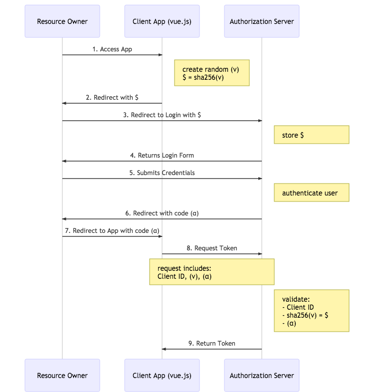

[OAuth 2.0](https://oauth.net/2/) 是用于授权的行业开放标准协议，在这个标准中，用户可以在第三方应用访问该用户在某一平台上存储的资源，也就是我们经常看到的某些平台可以使用第三方账号登陆。

对于无后端应用来说，OAuth 提供的授权码模式就无法实现，对于希望依靠前端的应用来说，AppId 和 AppSecret 的存储显得不是很安全，并且对于 Access Token 传输也是一个需要重点考虑的问题。

在 OAuth 2 中有一个隐式授权（Implicit Flow），它在 [RFC 6749](https://tools.ietf.org/html/rfc6749#section-4.1) 中有说明，但安全性太低，目前已经弃用了。

那么在 [okta](https://developer.okta.com/) 中有推行另一种授权码流 PKCE（Proof Key for Code Exchange by OAuth Public Clients，发音为 pixie）来缓解截获授权代码的威胁，详细规格可在 [RFC 7636](https://tools.ietf.org/html/rfc7636) 查看

<!-- more -->

### PKCE 授权流

PKCE 模式的授权流程如下：
1. 用户访问客户端
2. 客户端生成一个随机值 v 存储在浏览器中，对这个值用 SHA-256 算法加密得到 $
3. 携带着加密的随机值 $ 重定向到授权页面
4. 授权服务器保存这一加密的随机值 $，返回授权页面
5. 用户进行登陆授权
6. 授权服务器返回一个授权码 code
7. 浏览器携带这一授权码 code 重定向到客户端
8. 客户端向授权服务器发送一个 POST 请求，请求携带的数据包括客户端 ID、一开始生成的随机数 v，授权码 code
9. 授权服务器会校验客户端 ID、code、使用 SHA-256 算法加密 v 后得到的 $，校验成功返回 token

图片来源于 [Implement the OAuth 2.0 Authorization Code with PKCE Flow](https://developer.okta.com/blog/2019/08/22/okta-authjs-pkce/?utm_campaign=text_website_all_multiple_dev_dev_oauth-pkce_null&utm_source=oauthio&utm_medium=cpc)

**这一过程中的关键在于一开始的 $ 和后面发送请求传入的 v，由于 v 是存储在客户端或者浏览器，所以其它人无法获得。**

**对于授权服务器来讲，只需要确定 code 对应的用户，接下来只需要校验客户端发送请求传入的 v 进行加密后的值 $ 是否与该用户授权时的 $ 相匹配，就可以确认该请求是否可信了。**

**由于获取 token 的操作为客户端进行 POST 请求，那么返回的 token 在传输过程中是不可见的，所以在这一个流程下相对安全。**

相比 PKCE 和 RFC 6749 的隐式授权，可以发现 PKCE 更容易理解，出现的问题也比较少，安全性更有保证。

个人觉得目前无后端项目需要使用到第三方授权，那么应当优先考虑 PKCE 这种方式，但实际在有后端的应用中，一些传输传输场景也可以使用 PKCE 这种思考。

## [参考资料](#参考资料)

1. [OAuth 2.0 — OAuth](https://oauth.net/2/)
2. [RFC 6749 - The OAuth 2.0 Authorization Framework](https://tools.ietf.org/html/rfc6749)
3. [RFC 6736 - Proof Key for Code Exchange by OAuth Public Clients](https://tools.ietf.org/html/rfc7636)
4. [OAuth 2.0 for Native and Mobile Apps](https://developer.okta.com/blog/2018/12/13/oauth-2-for-native-and-mobile-apps#authorization-code-with-pkce-flow)
5. [Implement the OAuth 2.0 Authorization Code with PKCE Flow](https://developer.okta.com/blog/2019/08/22/okta-authjs-pkce/?utm_campaign=text_website_all_multiple_dev_dev_oauth-pkce_null&utm_source=oauthio&utm_medium=cpc)
