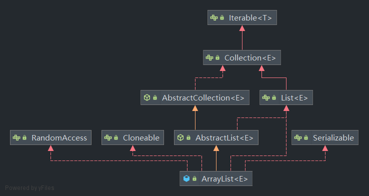

在 Java 中，数组可用来存储相同类型的多个数据，但由于长度不可变，在某些场景下使用比较局限。当我们希望使用类似数组的结构来存储未知个数的元素时，可以使用 `ArrayList<E>`。

ArrayList 是 **Java Collection Framework** 的成员，属于 `List<E>` 接口中的一个 **可变长数组** 实现，直接 extends `AbstractList<E>` abstract 类。其继承关系如下：

```Java
public class ArrayList<E> extends AbstractList<E>
        implements List<E>, RandomAccess, Cloneable, java.io.Serializable
```



## ArrayList 底层结构

对于 ArrayList，Java API 对它的第一句描述为 “Resizable-array implementation of the List interface”。其底层存储元素的结构为 Object 数组。

```Java
private static final int DEFAULT_CAPACITY = 10;

private static final Object[] EMPTY_ELEMENTDATA = {};

private static final Object[] DEFAULTCAPACITY_EMPTY_ELEMENTDATA = {};

transient Object[] elementData;
```

ArrayList 存储元素的数组对象变量名为 elementData，在使用 `new ArrayList()` 创建对象时使用 `DEFAULTCAPACITY_EMPTY_ELEMENTDATA`（一个长度为 0 的数组）来对 elementData 进行初始化。

```Java
private static final Object[] DEFAULTCAPACITY_EMPTY_ELEMENTDATA = {};

public ArrayList() {
    this.elementData = DEFAULTCAPACITY_EMPTY_ELEMENTDATA;
}
```

ArrayList 有一个构造方法 `ArrayList(int initialCapacity)` 让我们传入一个 int 类型的参数，这可以让我们在创建 ArrayList 对象时对 elementData 进行自定义的初始化，ArrayList 会将传入的 initialCapacity 参数来作为初始化 elementData 的长度。当 initialCapacity 是 0 时，使用 `EMPTY_ELEMENTDATA` 以一个长度为 0 的数组来初始化 elementData。

```Java
private static final Object[] EMPTY_ELEMENTDATA = {};

public ArrayList(int initialCapacity) {
    if (initialCapacity > 0) {
        this.elementData = new Object[initialCapacity];
    } else if (initialCapacity == 0) {
        this.elementData = EMPTY_ELEMENTDATA;
    } else {
        throw new IllegalArgumentException("Illegal Capacity: "+
                                            initialCapacity);
    }
}
```

## 可变长原理

ArrayList 使用数组来存储元素，而数组长度是固定的，添加的元素数量可能会超过数组容量，并且如果我们创建 ArrayList 对象时不指定 initialCapacity 或指定为 0 的话，那么 elementData 的长度是 0，无法放入元素。因此如果希望 ArrayList 是可变长的，需要有一个扩容机制。

在 ArrayList 中，每次添加元素都会先调用 `ensureCapacityInternal(int minCapacity)` 方法，之后才会进行添加操作，只要完成了添加操作，`add(E e)` 方法总是会返回 true 来表示添加成功。那么关键的代码就在于 `ensureCapacityInternal` 这个方法做了哪些操作。

```Java
public boolean add(E e) {
    ensureCapacityInternal(size + 1);  // Increments modCount!!
    elementData[size++] = e;
    return true;
}
```

```Java
private static final int DEFAULT_CAPACITY = 10;

private void ensureCapacityInternal(int minCapacity) {
    ensureExplicitCapacity(calculateCapacity(elementData, minCapacity));
}

private static int calculateCapacity(Object[] elementData, int minCapacity) {
    if (elementData == DEFAULTCAPACITY_EMPTY_ELEMENTDATA) {
        return Math.max(DEFAULT_CAPACITY, minCapacity);
    }
    return minCapacity;
}

private void ensureExplicitCapacity(int minCapacity) {
    modCount++;

    // overflow-conscious code
    if (minCapacity - elementData.length > 0)
        grow(minCapacity);
}
```

`ensureCapacityInternal` 方法传入的参数 minCapacity 为进行添加操作时 elementData 所需的最小容量，方法内可以分为两步操作：

1. 第一步调用 `calculateCapacity(Object[] elementData, int minCapacity)` 来计算 elementData 所需容量。
   - 当 elementData 为 `DEFAULTCAPACITY_EMPTY_ELEMENTDATA` 时，代表 elementData 需要进行初始化扩容。ArrayList 中有一个默认的数组初始化容量大小 `DEFAULT_CAPACITY = 10`，ArrayList 添加第一个元素时，以该值作为数组长度进行初始化扩容。
   - 由于 ArrayList 中有 `addAll(int index, Collection<? extends E> c)` 方法来添加多个元素，添加的元素个数可能比 `DEFAULT_CAPACITY` 的值要大，因此需要比较 minCapacity 与 `DEFAULT_CAPACITY` 的大小，取大的一个作为 elementData 所需容量进行返回。
   - 当 elementData 已经进行过初始化扩容时，直接将 minCapacity 作为所需容量返回。

2. 第二步调用 `ensureExplicitCapacity(int minCapacity)` 方法根据所需容量大小来判断是否需要进行扩容，如果所需容量大于当前 elementData 的容量，则调用 `grow(int minCapacity)` 方法进行扩容操作。

## 扩容方式

```Java
private static final int MAX_ARRAY_SIZE = Integer.MAX_VALUE - 8;

private void grow(int minCapacity) {
    // overflow-conscious code
    int oldCapacity = elementData.length;
    int newCapacity = oldCapacity + (oldCapacity >> 1);
    if (newCapacity - minCapacity < 0)
        newCapacity = minCapacity;
    if (newCapacity - MAX_ARRAY_SIZE > 0)
        newCapacity = hugeCapacity(minCapacity);
    // minCapacity is usually close to size, so this is a win:
    elementData = Arrays.copyOf(elementData, newCapacity);
}

private static int hugeCapacity(int minCapacity) {
    if (minCapacity < 0) // overflow
        throw new OutOfMemoryError();
    return (minCapacity > MAX_ARRAY_SIZE) ?
        Integer.MAX_VALUE :
        MAX_ARRAY_SIZE;
}
```

`grow` 方法中扩容方式为使用 `Arrays.copyOf(T[] original, int newLength)` 方法来生成一个包含原数组元素的新数组，而新数组容量 newCapacity 取决于 oldCapacity（原本 elementData 的容量），在原本 elementData 的容量上增加一半，这个操作通过对 oldCapacity 进行右移完成。

当得到的 newCapacity 比所需的最小容量小时，将会直接使用 minCapacity 作为 newCapacity 的值。

当 elementData 为 `DEFAULTCAPACITY_EMPTY_ELEMENTDATA` 时，代表原本长度为 0，则 newCapacity 的值也为 0，那么 newCapacity - minCapacity 将会小于 0，此时新数组容量将会变成 minCapacity，也就是 DEFAULT_CAPACITY，从而初步扩容出一个容量为 10 的 elementData。

## 最大容量

ArrayList 存放元素的结构为数组，因此 ArrayList 的最大容量也取决于数组的最大容量。

在 ArrayList 中使用 `MAX_ARRAY_SIZE` 来代表数组最大长度，数组的长度定义为非负的 int 类型，因此数组的最大长度为 int 类型的最大值。由于在一些虚拟机中，一个数组还包括头部等内容，因此最大长度可能会比 int 的最大值要小，所以 ArrayList 的 `MAX_ARRAY_SIZE` 的值为 `Integer.MAX_VALUE - 8`；

当通过计算得出的 newCapacity 大小比 MAX_ARRAY_SIZE 大时，将会调用 `hugeCapacity(int minCapacity)` 来尝试获取数组的可能的最大值来作为 newCapacity 的值。

当 minCapacity 的值为负数时，代表所需最小容量超过了 int 类型最大值，发生了溢出，此时将会在 hugeCapacity 方法内主动抛出 `OutOfMemoryError`。如果不为负数时，当 minCapacity 比 `MAX_ARRAY_SIZE` 大的话，则尝试使用 `Integer.MAX_VALUE` 来作为容量大小，否则使用 `MAX_ARRAY_SIZE`。

## 使用场景

ArrayList 由于其底层结构为数组这一特点，在使用 get 通过下标获取元素时，所需时间复杂度为 O(1)，获取比较快。但在插入时，需要对插入位置和后面的元素进行移动，在 ArrayList 的 size 比较大时，这可能需要花费较多的时间。

```Java
public void add(int index, E element) {
    rangeCheckForAdd(index);

    ensureCapacityInternal(size + 1);  // Increments modCount!!
    System.arraycopy(elementData, index, elementData, index + 1,
                        size - index);
    elementData[index] = element;
    size++;
}
```

在 ArrayList 中，这一操作使用 `System.arraycopy()` 来对需要移动的元素进行复制，从而提高元素移动操作的效率，但每次添加或插入元素时，不可避免地需要调用 `ensureCapacityInternal` 来判断所需容量是否足够，当不充足时需要进行扩容操作。因此 ArrayList 更适合于简单的存储、查找、修改对应位置数据的场景，如果需要频繁对容器的元素进行增删操作，那么可以使用 LinkedList 来提高代码的性能。

## 参考

> JDK 1.8 源码 与 Java API 文档: 
> 
> https://docs.oracle.com/javase/8/docs/api/java/util/List.html
> 
> https://docs.oracle.com/javase/8/docs/api/java/util/AbstractList.html
> 
> https://docs.oracle.com/javase/8/docs/api/java/util/ArrayList.html
