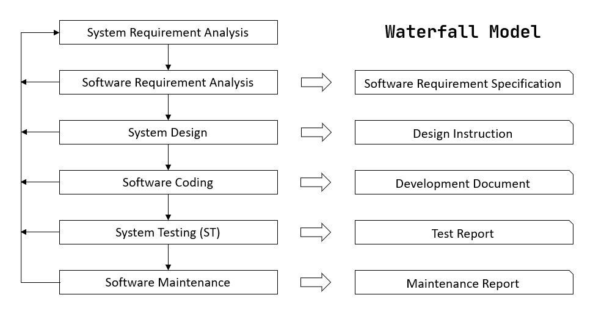
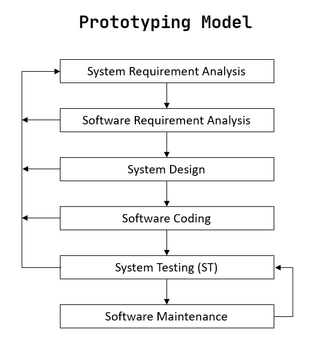
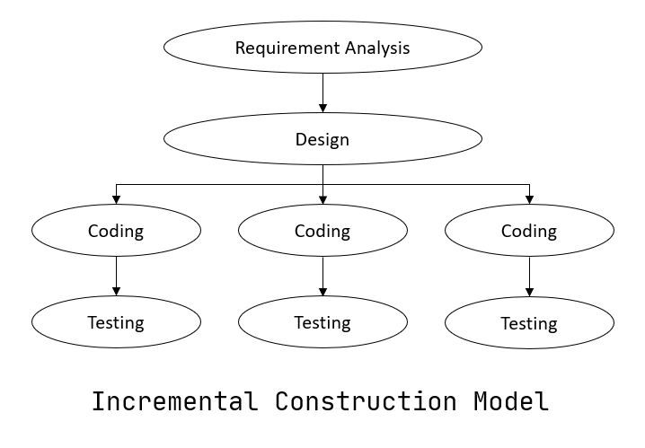
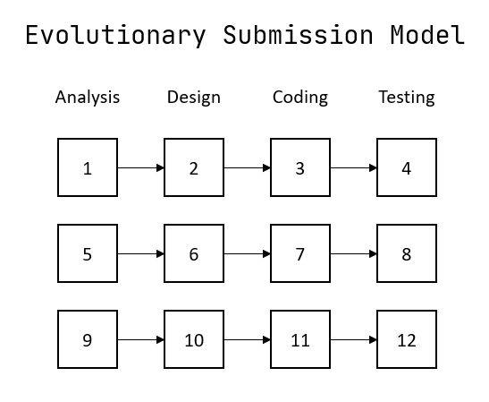
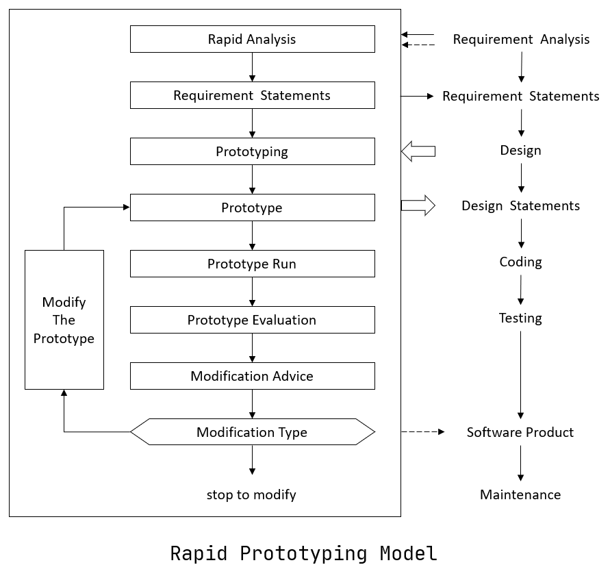
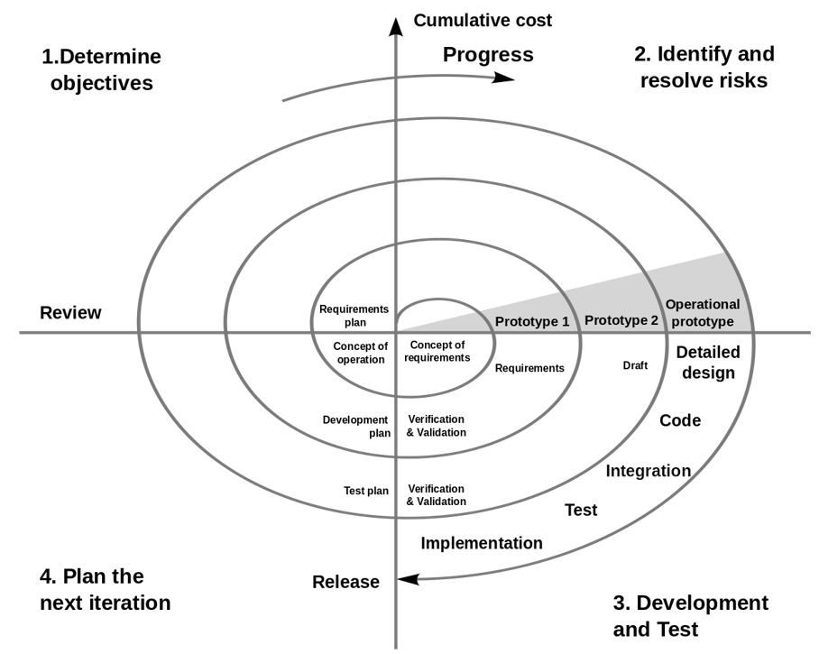
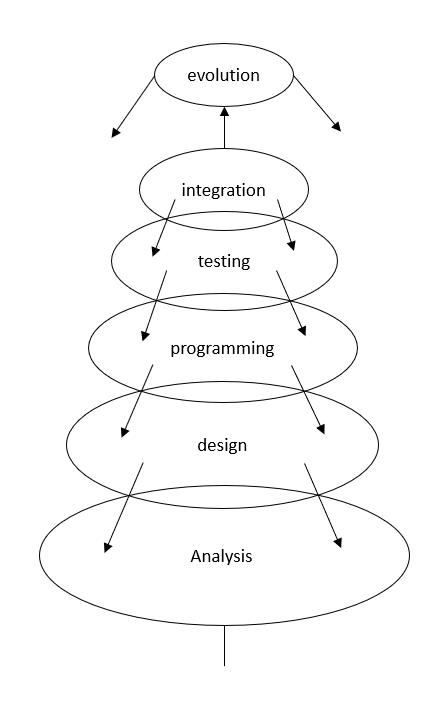
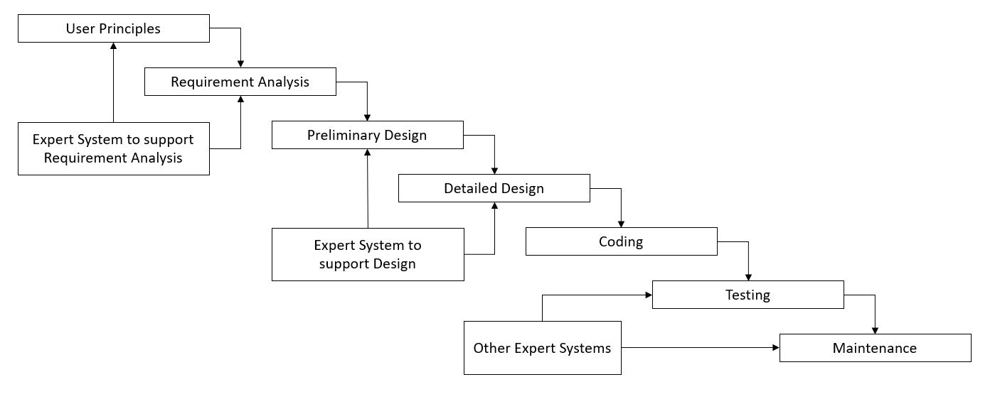

The life cycle is the most fundamental concept in Software Engineering. The methods, tools,and management of Software Engineering are activities based on the software life cycle.

It is also called **SDLC (Systems Development Life Cycle / Software Development Lift Cycle)**.

The stage division in the software life cycle depends on the size, nature, type and development method of the software. It has been proposed to divide the software life cycle into four activity cycles.

They are the software analysis period, the software design period, the coding and testing period, and the operation and maintenance period.

<!-- more -->

### Software Analysis Period

The fundamental task of this period is to determine the goal of the software project, the function and performance that the software should have, construct the logical model of the software, and formulate the acceptance criteria.

We need to know what is the problem to be solve? How to solve this problem? How much time and resources will it take? etc...

Therefore, this period includes three phases of problem definition, feasibility analysis, and requirements analysis, and may also be subdivided due to the size of the software system. And it also requires **SRS (Software Requirement Specification)**.

### Software Design Period

During this period, we need to design the logical model from the analysis period into a concrete computer software scheme.

It includes the following there aspects:

1. Design the overall structure of the software
2. Design software specific module implementation algorithm
3. Prior to the completion of software design, relevant review shall be conducted

Then, we may need to carry out **preliminary design (High Level Design, HLD)** and  **detailed design (DDS)**.

### Coding and Testing

This is a period of implementing software.

**Coding**

When coding, we should guarantee the quality and readability of the code. The structure of the program should be clear.

It is better to have a development document to standardize and record the coding stage, and a development document will also facilitate the maintenance of the system.

**Testing**

Testing is an important meants to ensure software quality. The main way is to design test cases to detect each part of the software.

- Module Testing: Find functional and structural problems with each module.
- Assembly Testing: Assemble the modules in a certain order to find problems in the interfaces between the modules.
- Validation Testing: Check each function item by item according to the software requirements specification to find problems that don't meet user requirements.

### Software LifeCycle Model

In the past practice, we summarized the general thinking of the successful software development process and gave birth to many software life cycle models.

#### Waterfall Model

The process sequence of watefall model is:

#### Prototyping Model

The prototyping Model uses some tools to build a simplified model of the actual system as quickly as possible.

It flows like this:

The Prototyping Model adopts the method of improving the model step by step, which is repeated and promoted continuously.

#### Incremental Model

- Incremental Construction Model: The Requirements analysis phase and the design phase are developed as watefall model, but the coding phase and the testing phase are developed in an incremental manner.

- Evolutionary Submission Model: Each phase of project development is incremental.

- Rapid Prototyping Model: Learn and modify the prototype constantly during the development process.

#### Spiral Model

The Spiral Model combines the advantages of traditional software life cycle model and prototype model.

The Spiral Model is a risk-driven model. It combines Waterfall Model and Incremental Model, adds the risk analysis ignored by both models, makes up for the shortcomings of both models.

#### Fountain Model

1. The development process of the model includes analysis, design, implementation, testing and integration.
2. The model returns from the top to the bottom without resource consumption, reflecting the natural characteristics of software process iteration.
3. On the basis of analysis, resource consumption is in the form of a tower, and more resources are consumed in the analysis stage.
4. The overlapping of each stage reflects the parallelism of software process.
5. The model emphasizes incremental development, and the whole process is an iterative and step-by-step process of refinement.
6. Models are object-driven processes, and objects are the subject of all activities and the basic content of project management.
7. Due to different activities, the model implementation can be divided into system implementation and object implementation.

#### Knowledge Based Model

The Knowledge Based Model is a combination of Waterfall Model and an expert system.

#### Transformational Model

Transformational Model is maninly used in the formal development of software.

Start with a formalization description of the software requirements, after a series of transformation, the final target program of the system is obtained.
